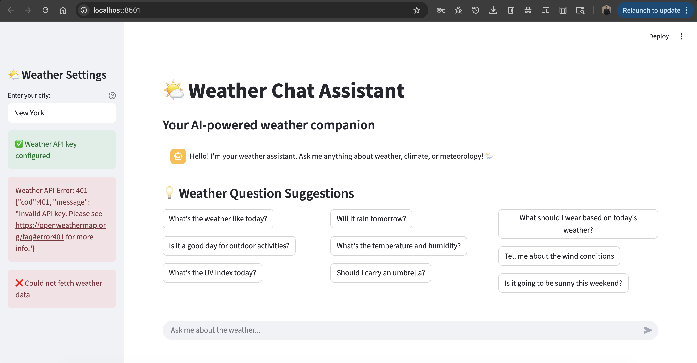

# Weather Chat Assistant 🌤️

A simple weather chatbot built with Streamlit and Google's Gemini AI. Ask it anything about weather and get intelligent responses!

## What it does

- Chat with AI about weather topics
- Get real-time weather data for any city
- Smart suggestions for weather questions
- Only talks about weather (redirects other topics)

## How to run

1. Clone this repo
2. Install requirements: `pip install -r requirements.txt`
3. Get API keys:
   - Google Gemini AI (already configured)
   - OpenWeatherMap (free at openweathermap.org)
4. Add your weather API key to `.streamlit/secrets.toml`
5. Run: `streamlit run app.py`

## Features

- **AI Chat**: Powered by Gemini AI
- **Weather Data**: Real-time conditions, temperature, humidity
- **Smart Focus**: Weather-only conversations
- **Easy UI**: Click suggestions or type questions

## Tech Stack

- Streamlit (web app)
- Google Gemini AI (chatbot)
- OpenWeatherMap API (weather data)

## Note

Weather API key might take 1-2 hours to activate after signup. The chat works immediately though!

---

Built with ❤️ for weather enthusiasts
